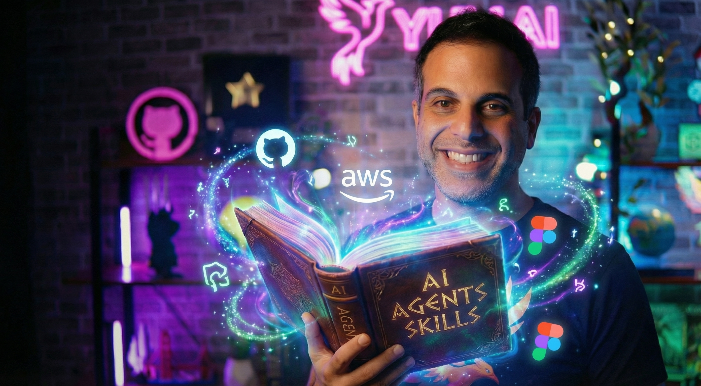

<p align="center">
  
  
  
</p>

<p align="center">
  
</p>

<h1 align="center">🧠 Agent Skills Repository</h1>

<p align="center">
  <strong>A curated collection of AI agent skills for enhanced coding assistance</strong>
</p>

<p align="center">
  <em>Supercharge your AI coding agents with specialized knowledge and production-ready patterns</em>
</p>

<p align="center">
  <a href="#-available-skills">Skills</a> •
  <a href="#-quick-start">Quick Start</a> •
  <a href="#-usage">Usage</a> •
  <a href="#-contributing">Contributing</a>
</p>

---

## 👤 Author

<table>
<tr>
<td width="150">

</td>
<td>

### **Yuval Avidani**
**AI Builder & Speaker** | **GitHub Star ⭐** | **AWS GenAI Superstar 🌟**

Building the future with AI agents, automation, and cutting-edge technology.  
20+ years turning complex ideas into production-ready solutions.

[](https://yuv.ai)
[](https://github.com/yuval-avidani)
[](https://github.com/yuval-avidani)

🎤 **Speaker & Enterprise AI Trainer**  
🏆 **Recognized for open-source contributions**

</td>
</tr>
</table>

> 🤖 *This repository was created by Yuval Avidani using **GitHub Copilot** via **VS Code Insiders** — demonstrating the power of AI-assisted development!*

---

## ✨ What Are Agent Skills?

Agent skills are **specialized knowledge modules** that enhance AI coding agents with domain-specific expertise. They provide:

- 🎯 **Focused Knowledge** — Only what the AI doesn't already know
- 📝 **Production-Ready Code** — Working examples, not abstract concepts  
- ⚡ **Quick Activation** — Trigger keywords for instant context
- 🔄 **Reusable Patterns** — Copy once, use everywhere

---

## 📦 Available Skills

| Skill | Description | Keywords |
|:------|:------------|:---------|
| **[aws-agentcore](skills/aws-agentcore/SKILL.md)** | AWS Bedrock AgentCore development patterns | `AgentCore`, `Bedrock Agent`, `AWS agent` |
| **[aws-strands](skills/aws-strands/SKILL.md)** | Model-agnostic agent framework with Strands SDK | `Strands`, `ReAct agent`, `model-agnostic` |
| **[langchain](skills/langchain/SKILL.md)** | LangChain/LangGraph pipelines and agent workflows | `LangChain`, `LangGraph`, `RAG`, `LCEL` |
| **[vercel](skills/vercel/SKILL.md)** | Vercel deployment, serverless, and edge functions | `Vercel`, `serverless`, `edge function` |
| **[railway](skills/railway/SKILL.md)** | Railway platform deployment and configuration | `Railway`, `deploy container` |
| **[figma](skills/figma/SKILL.md)** | Figma API integration and design token extraction | `Figma API`, `design tokens` |
| **[shabbat-times](skills/shabbat-times/SKILL.md)** | Jewish calendar data and Shabbat times integration | `Shabbat times`, `Hebcal`, `Zmanim` |
| **[copilot-docs](skills/copilot-docs/SKILL.md)** | GitHub Copilot custom instructions reference | `copilot-instructions.md` |
| **[nano-banana-pro](skills/nano-banana-pro/SKILL.md)** | Google Gemini 3 Pro Image generation | `Nano Banana Pro`, `Gemini 3 Pro Image` |
| **[github-trending](skills/github-trending/SKILL.md)** | GitHub trending repositories scraping | `GitHub trending`, `trending repos` |
| **[ux-design-systems](skills/ux-design-systems/SKILL.md)** | Design systems and component libraries | `design system`, `design tokens`, `theming` |
| **[web-accessibility](skills/web-accessibility/SKILL.md)** | WCAG compliance and accessibility patterns | `accessibility`, `a11y`, `WCAG`, `ARIA` |
| **[mobile-responsiveness](skills/mobile-responsiveness/SKILL.md)** | Responsive design and mobile-first patterns | `responsive`, `mobile-first`, `breakpoints` |
| **[analytics-metrics](skills/analytics-metrics/SKILL.md)** | Data visualization and analytics dashboards | `analytics`, `dashboard`, `charts`, `KPI` |
| **[mermaid-diagrams](skills/mermaid-diagrams/SKILL.md)** | Mermaid diagram syntax for visualizations | `Mermaid`, `flowchart`, `sequence diagram` |

---

## 🚀 Quick Start

### 1. Clone the Repository

```bash
git clone https://github.com/yuval-avidani/ai-agents-skills.git
```

### 2. Copy Skills to Your Project

Choose your AI coding agent and follow the instructions below.

---

## 💻 Usage

<details>
<summary><strong>🟣 Claude Code</strong></summary>

Copy skills to `.claude/skills/` in your project:

```bash
# Single skill
cp -r skills/aws-agentcore .claude/skills/

# All skills
cp -r skills/* .claude/skills/
```

</details>

<details>
<summary><strong>🟢 GitHub Copilot</strong></summary>

Reference skills in `.github/copilot-instructions.md`:

```markdown
# Project Instructions

## Deployment
See skills/vercel/SKILL.md for deployment patterns.

## Agent Development  
See skills/aws-agentcore/SKILL.md for AgentCore patterns.
```

Or copy skills directly:
```bash
cp -r skills .github/
```

</details>

<details>
<summary><strong>🔵 Cursor</strong></summary>

Add to `.cursor/rules/`:

```bash
# All skills
cp skills/*/SKILL.md .cursor/rules/

# Or specific skills
cp skills/langchain/SKILL.md .cursor/rules/
```

</details>

<details>
<summary><strong>🟡 Windsurf</strong></summary>

Add to `.windsurf/rules/`:

```bash
# All skills
cp skills/*/SKILL.md .windsurf/rules/

# Or specific skills
cp skills/vercel/SKILL.md .windsurf/rules/
```

</details>

---

## 📐 Skill Format

Each skill follows a consistent structure:

```markdown
---
name: skill-name
description: Brief description with trigger keywords
---

# Skill Title

Quick start and core patterns...
```

### 🎯 Key Principles

| Principle | Description |
|:----------|:------------|
| **Concise is key** | Only include what the AI doesn't already know |
| **Progressive disclosure** | Start with quick start, then advanced patterns |
| **Concrete examples** | Working code over abstract descriptions |
| **Trigger keywords** | Include words that activate the skill |

---

## 📁 Repository Structure

```
ai-agents-skills/
├── 📄 README.md
├── 📁 skills/
│   ├── 📁 aws-agentcore/
│   │   └── 📄 SKILL.md
│   ├── 📁 aws-strands/
│   │   └── 📄 SKILL.md
│   ├── 📁 langchain/
│   │   └── 📄 SKILL.md
│   ├── 📁 vercel/
│   │   └── 📄 SKILL.md
│   ├── 📁 railway/
│   │   └── 📄 SKILL.md
│   ├── 📁 figma/
│   │   └── 📄 SKILL.md
│   ├── 📁 shabbat-times/
│   │   └── 📄 SKILL.md
│   ├── 📁 copilot-docs/
│   │   └── 📄 SKILL.md
│   ├── 📁 nano-banana-pro/
│   │   └── 📄 SKILL.md
│   ├── 📁 github-trending/
│   │   └── 📄 SKILL.md
│   ├── 📁 ux-design-systems/
│   │   └── 📄 SKILL.md
│   ├── 📁 web-accessibility/
│   │   └── 📄 SKILL.md
│   ├── 📁 mobile-responsiveness/
│   │   └── 📄 SKILL.md
│   ├── 📁 analytics-metrics/
│   │   └── 📄 SKILL.md
│   └── 📁 mermaid-diagrams/
│       └── 📄 SKILL.md
└── 📁 templates/
    └── 📁 skill-template/
        └── 📄 SKILL.md
```

---

## 🤝 Contributing

We welcome contributions! Here's how to add a new skill:

1. **Fork** this repository
2. **Create** a new skill in `skills/your-skill-name/SKILL.md`
3. **Follow** the [skill template](templates/skill-template/SKILL.md)
4. **Submit** a pull request

### Contribution Guidelines

- ✅ Include practical, production-ready code examples
- ✅ Add trigger keywords in the description
- ✅ Test all code snippets before submitting
- ✅ Keep explanations concise but complete
- ❌ Don't include basic concepts the AI already knows
- ❌ Don't use placeholder code or TODOs

---

## 🌟 Star History

If you find this repository useful, please consider giving it a ⭐!

---

## 📄 License

MIT License — Feel free to use, modify, and distribute.

---

<p align="center">
  <strong>Made with ❤️ by <a href="https://yuv.ai">Yuval Avidani</a></strong>
</p>

<p align="center">
  <em>Building AI agents that matter</em>
</p>

<p align="center">
  <a href="https://github.com/yuval-avidani">
    
  </a>
</p>
